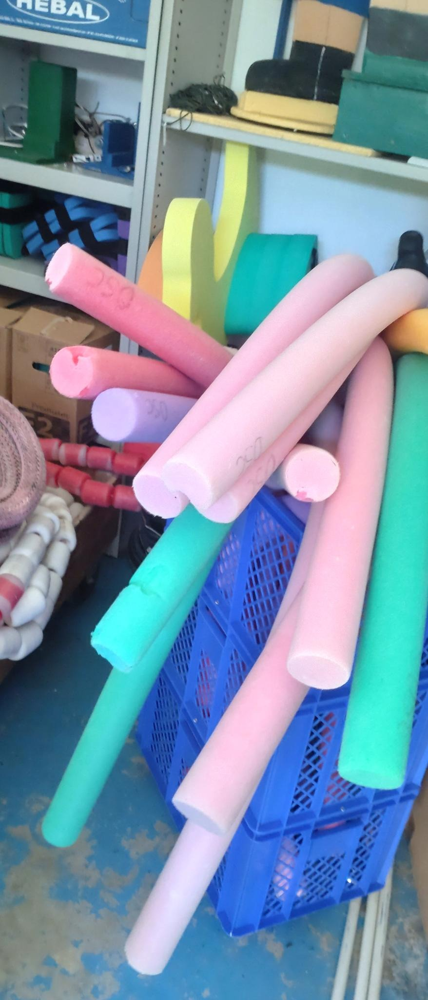
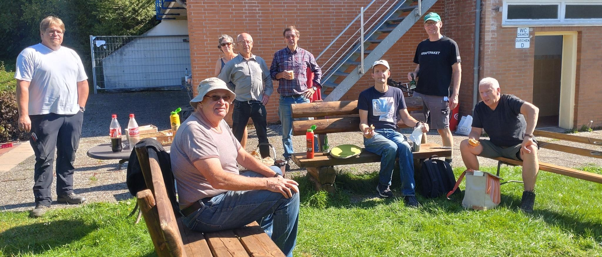

Am 16.09.23 fand der erste Arbeitseinsatz der Nachsaison statt. Ziel des Arbeitseinsatzes war die Vorbereitung auf den Herbst. Dazu wurden die Bänke abgebaut, die Schwimmnudel ins Winterquartier gebracht, die neu angeschafften Mülleimer gesäubert, verstaut und noch einiges mehr.

Am Ende wurde in geselliger Runde die eine oder andere Bratwurst gegrillt und gegessen, bevor es ins Wochenende ging.

Für den kommenden Arbeitseinsatz am 30.09.23 sind wieder alle herzlich eingeladen zu helfen.
