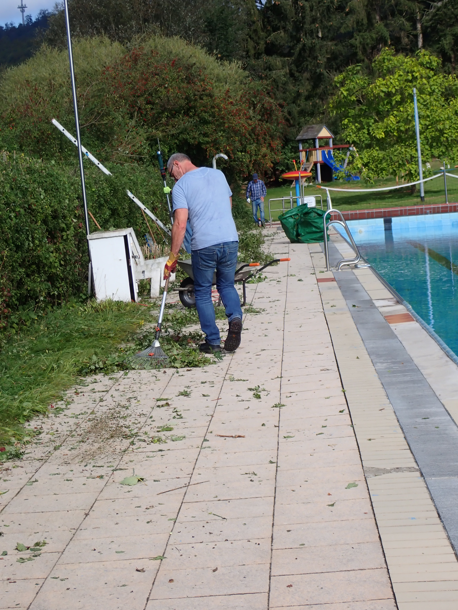
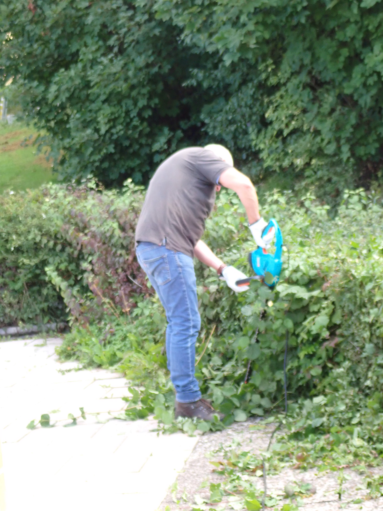
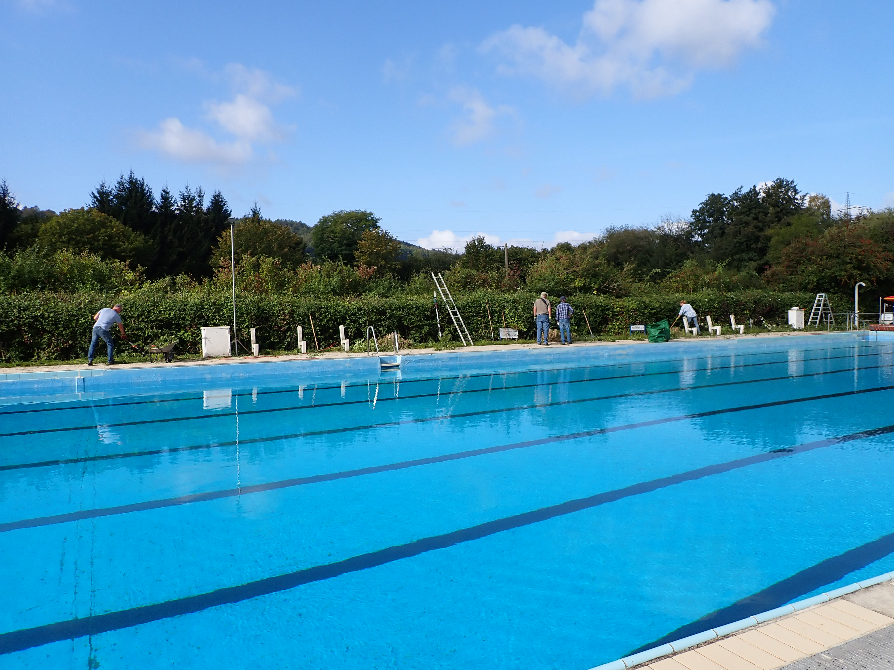
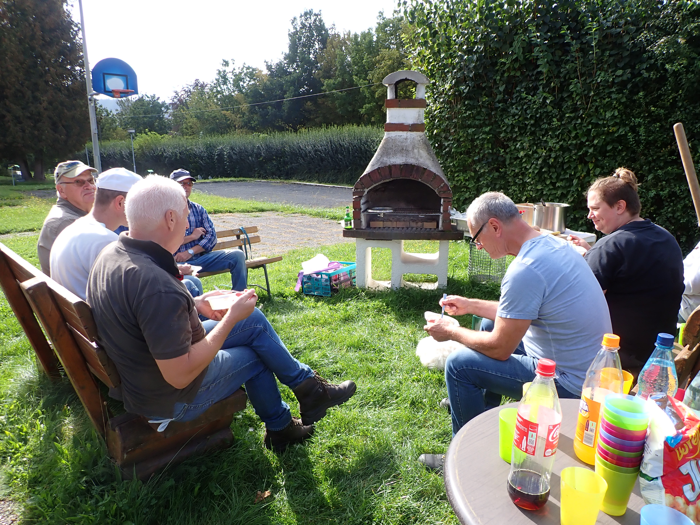
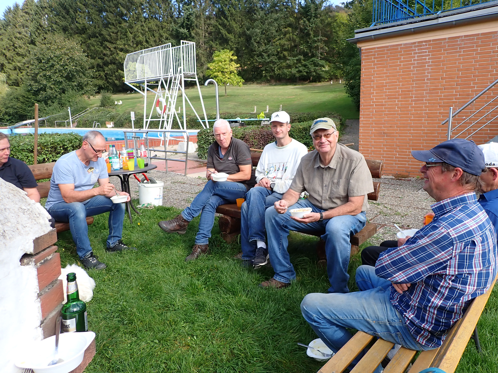

Am 30. 09. trafen sich die freiwilligen Helfer zum alljährlichen Heckenschnitt. Es wurde schnell festgestellt, dass die Hecken in diesem Jahr durch die guten Wachstumsbedingungen mehr gewachsen sind, als in den vergangenen Jahren.
Schnell wurde klar, dass hier mit einem Arbeitseinsatz die Hecken nicht komplett gestutzt werden können. Hier muss mindestens ein weiterer Einsatz erfolgen.

Am Ende haben alle Helfer in geselliger Runde beisammen gesessen und sich das Grillgut schmecken lassen.

